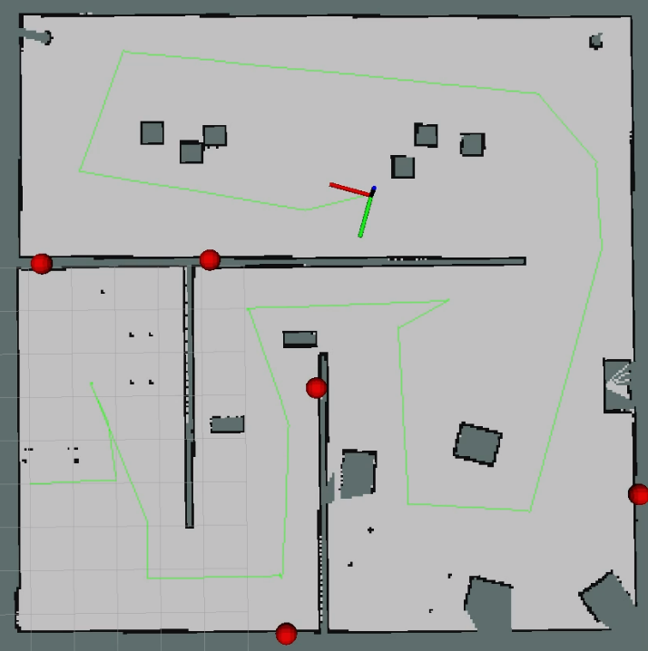
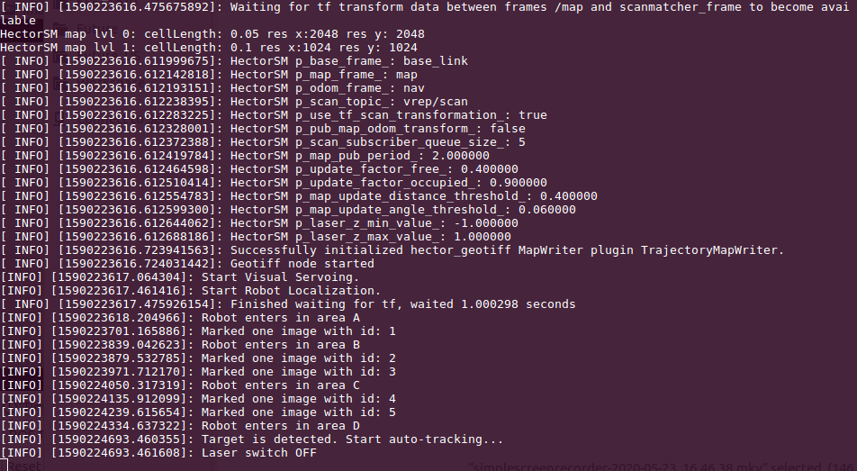

# ELEC 5670 Final Project


## Dependency


- ROS
- V-REP
- Other tools: `ros-kinetic-hector-slam`, `opencv-python`, `dlib`

## Code Structure


```bash
cd ./robot_project
tree -L 2
.
├── launch
│   └── final_project.launch   # all in one launch file
├── rviz_cfg                   # rviz config file for demo,
│   └── demo.rviz              # auto loaded by final_project.launch
├── src
│   ├── image_localization     # node image_localization
│   ├── laser_mapping          # node laser_mappting
│   └── visual_servoing        # node visual_servoing
└── ttt
    └── env_modified.ttt       # env file used by V-REP
```

## Run
```bash
# terminal 1 run roscore
roscore
# terminal 2 start vrep simulation env
cd $VREP_dir 
./vrep.sh
# terminal 3 run all with one laucn file
cd ./robot_project
catkin_make
roslaunch launch/final_project.launch
```

The interface is shown as bellow:


## Nodes

There are three ROS nodes in this project: *laser_mapping*, *image_localization* and *visual_servoing*. And these nodes are responsible for respective functions as follows: 

1. in node *laser_mapping*, we use arrow keys to move the robot and simultaneously build the 2D map through hector slam provided with laser scan data, 
2. in node *image_localization*, the robot detects and localize the images on the wall and mark them in the rviz, and also this node checks which area the robot enters in,
3. in node *visual_servoing*, it detects the yellow moving ball and if it occurs, it will switch from key controlling mode to auto tracking mode, and simultaneously the laser scan sensor turns off.

#### Laser Mapping

1. Key Control: arrow keysto move the robot 'space' key to stop. The interface is a terminal. It publishes topic `/vrep/cmd+vel`.

   

2. we use the hector slam algorithm to build the 2D map from the laser scan data. `ros-kinetic-hector-slam` is directly used in this node. It consumes the topic `/vrep/scan`. We need to modify the launch file as follows:

   ```xml
   <?xml version="1.0"?>
   
   <launch>
     <node pkg="laser_mapping" type="key_motion" name="key_motion" launch-prefix="xterm -e"/>
       
     <arg name="geotiff_map_file_path" default="$(find hector_geotiff)/maps"/>
       
     <param name="/use_sim_time" value="true"/>
       
     <node pkg="rviz" type="rviz" name="rviz"
       args="-d $(find hector_slam_launch)/rviz_cfg/mapping_demo.rviz"/>
       
     <include file="$(find hector_mapping)/launch/mapping_default.launch">
       <arg name="scan_topic" default="vrep/scan"/>
       <arg name="pub_map_odom_transform" default="false"/>
       <arg name="base_frame" default="base_link"/>
       <param name="odom_frame" value="base_link" />
     </include>
       
     <include file="$(find hector_geotiff)/launch/geotiff_mapper.launch">
       <arg name="trajectory_source_frame_name" value="scanmatcher_frame"/>
       <arg name="map_file_path" value="$(arg geotiff_map_file_path)"/>
     </include>
   </launch>
   ```

#### Image Localization

1. Provided with topic `/vrep/image`, this node firstly flip the image, and publish `/localize/image_flip`. It detects the face in the image using a face algorithm library `dlib`. With the `/vrep/scan` and the relative transformation between base, camera and laser sensor, it computes the image's coordinates of body frame. Then with topic `/slam_out_pose`, it transforms the coordinates from body frame to world frame, and publish topic `/localize/marker`.

   

2. This node also checks which area the robot is in. After we have built the 2D map once, we can get the boundaries between areas. When the robot crosses the boundary, it publish the topic `/localize/room` and output the information the terminal.

   

#### Visual Servoing

When the robot enters in area 'D', the ball detection automatically starts. And when the yellow ball is detected, auto-tracking begins to compute the desiring linear velocity and angular velocity and publish topic `/vrep/cmd_vel`. 


